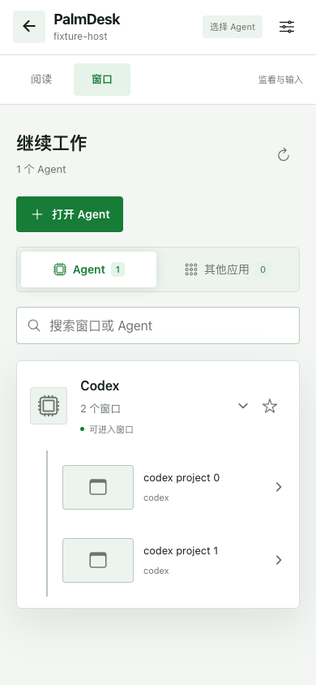

# Open Agent validation — 2026-10-02

Scope: issue #37. Built on `b762f09`. Local host: macOS 26.6.2 (Apple Silicon), Node 22.16.0, Chrome 154.0.8037.93. No production Agent sessions were changed by these tests.

## Behavior and supported installations

The controller sends only a known Agent ID over the existing authenticated connection. The host main process resolves installed applications again for each explicit launch. The desktop renderer restricts requests to the current authenticated peer, and the main process restricts IPC to its own primary window. An in-progress launch excludes other launches/window selections. Disconnect cancellation reaches pending main-process work; a native command already submitted to the OS cannot be undone. Launches are never automatically retried or replayed after reconnect.

- macOS: installed bundles found by Launch Services, validated against the registered Agent bundle ID and an executable file. The normal open/reopen request activates an existing process without requesting a new instance.
- Windows: the current user's installed MSIX application manifests and HKCU/HKLM App Paths (including the 32-bit machine registry location), matched against registered Agent executable names. MSIX applications use `shell:AppsFolder` with the host-resolved application ID; desktop executables receive no arguments. Discovery uses a fixed PowerShell script with bounded runtime/output, without controller-provided commands or paths. No PATH search, arbitrary shortcuts, unregistered portable apps or CLI launch targets.
- Windows capture remains current-virtual-desktop only. Linux hosts and older hosts report launching unavailable. Existing running windows remain usable even when their installation cannot be launched automatically.

After a successful OS launch request, the controller polls the normal authenticated window catalog for up to approximately 15 seconds. One matching native Agent window enters the existing identity-checked selection/capture flow; multiple windows expand for selection. No window, launch failures, permission errors and list timeouts retain refresh/retry. Switching to Read, backgrounding, or disconnecting cancels automatic follow-through and never resends the launch.

## Verification

| Check | Result and boundary |
| --- | --- |
| `pnpm test:smoke` | 329 passed, 3 existing platform/interactive tests skipped. Includes nine new launch/authorization/cancellation tests. |
| `pnpm typecheck` | Passed. |
| ESLint on changed production TS/Vue and launch unit tests | Passed. |
| `pnpm build:prod` | Passed; existing browser-data and large-chunk warnings remain. |
| `pnpm build:native` | Passed on macOS. |
| `pnpm build:desktop` | Passed; built an isolated, ad-hoc signed macOS worktree app. No publication or production identity changes. |
| `node test/smoke/macos-agent-launch.cjs` | Real Launch Services discovery, missing-app rejection, cold launch, then reopening a disposable app after closing its last window. Verified the process ID stayed the same. Fixture was ad-hoc signed, registered, stopped and unregistered, then removed. |
| `node test/smoke/agent-launch-browser.mjs` | Real controller page and AgentPicker in headless Chrome, replacing signaling/host responses. Verified empty directory → explicit launch → delayed single-window selection; duplicate-click prevention; multiple-window choice; opening another installed Agent while one already has a window; no-window timeout and explicit retry; removed-app failure; no installed apps; distinct search-empty state; unsupported and old hosts; Read navigation and disconnect ignore late results; portrait/landscape layout, with no browser errors. |

Launch unit tests also cover invalid Agent IDs and operation IDs, removing an app between discovery and launch, deduplicating concurrent launches, cancelling a queued native request, Windows path/AUMID filtering, shell-free spawn arguments, cancellation after executable validation, and recovery after an OS launch error. Windows OS calls are test doubles on this Mac; these results do not establish native Windows launch acceptance.

Browser reproduction (requires a resolvable `playwright` installation and Chrome, or `SMOKE_BROWSER_EXECUTABLE`):

```sh
pnpm exec vite --config test/smoke/agent-launch.vite.mjs
node test/smoke/agent-launch-browser.mjs
```

The browser script saves synthetic screenshots under `.local/agent-launch-smoke/`. The macOS native script requires a graphical login session and the native build. It only opens its uniquely identified disposable test application.

## Synthetic UI screenshots




## Remaining real-device acceptance

A physical phone connected to actual Codex/Claude/ChatGPT/Kimi/ZCode installations was not tested. Record per-app reopening behavior: an application's open request may not produce a new window. Real Windows discovery and launch of both an MSIX app and an App Paths desktop app remain unvalidated, including non-ASCII installation paths, unavailable PowerShell/AppX discovery, removed registrations, current-desktop visibility and already-running apps without windows. Physical iOS Safari and Android connection/capture acceptance remains pending. The browser test validates UI/protocol handling; the macOS native fixture validates OS launch/reopen, not a complete real-device stream.
